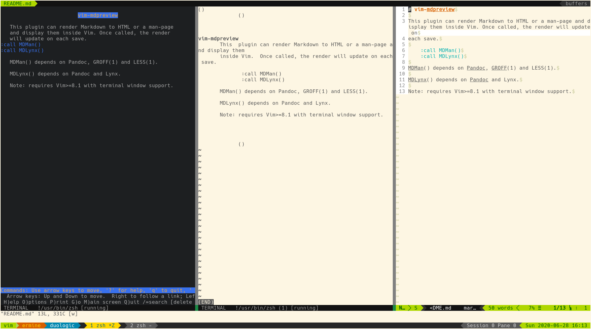

# vim-mdpreview

This plugin can render Markdown to HTML or a man-page and display them inside Vim. Once called, the render will update on
each save.

## Usage

    :call MDMan()
    :call MDLynx()

## Requirements

Requires Vim>=8.1 with terminal window support.

MDMan() depends on Pandoc, GROFF(1) and LESS(1).

MDLynx() depends on Pandoc and Lynx.

## Screenshot

